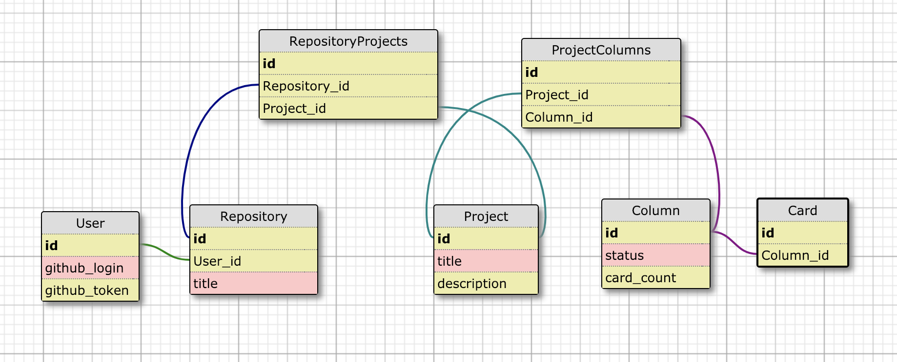

[](https://circleci.com/gh/hbellows/git_wired_be/tree/master)
[](https://codecov.io/gh/hbellows/git_wired_be)
# About This Project
This API application contains endpoints that can be consummed by a frontend application to help developers track frontend functionality creation and completion by matching their github issues to an customizable, animated wireframe.  The user can specify wireframe elements and link them to the corresponding github issue.  The wireframe element will then change shade based on the issue's status as it progresses through development (ie, "To Do", "In Progress", and "Done").

View this application's progess by visiting it's [project board](https://github.com/hbellows/git_wired_be/projects/1).

## System Requirements
Please note: This application uses GitHub for Oauth, so you'll likely need to grab your own GitHub developer keys prior to using this application.

More information about GitHub developer keys can be found in the [GitHub developer docs](https://developer.github.com/v3/).

 - Ruby >= 2.4.0
 - Rails >= 5.1.6
 - Your own GitHub API key
 - Please see the following section for instructions on handling personal api keys.

# Inital Setup
1. Clone or fork this project to your local machine.
2. Run `bundle` in the project folder.
3. Run `figaro install` in the project folder.
4. Add the following API keys to config/application.yml with the variable names exactly as shown:
   - `GITHUB_API_KEY`
5. Run `rails db:{create,migrate,seed}` in the project folder.
6.

# How To Use 
These are the endpoints that are currently available in the application:

## Repositories

To see all repositories for a user: 
```
GET to '/api/v1/repositories?user_name=user_name
```
```
{
    "data": {
        "id": "hbellows",
        "type": "repository",
        "attributes": {
            "repositories": [
                {
                    "id": 1,
                    "name": "git_wired_be",
                    "github_id": "170214553"
                },
                {
                    "id": 2,
                    "name": "Brownfield-of-Dreams",
                    "github_id": "170607745"
                },
                {
                    "id": 3,
                    "name": "quantifiedSelfApi",
                    "github_id": "168269382"
                }
            ]
        }
    }
}
```
## Projects


# Running Tests
Run `rspec` to run the full test suite, or `rails server` to load up the application.
# Dependencies
# Contributing
GitWired is an open source project. We invite your participation through issues and pull requests! 

When adding or changing a service please add tests.

Issues needing additional support:
- Issue 1 Placeholder
- Issue 2 Placeholder

# Related Projects

More information about GitWiredFe can be found [here](https://github.com/JoelSmith123/git_wired_fe).
The GitWired frontend application is a JavaScript/React application that consummes the endpoints provided in this API.  

# Schema


# Contributors
This is a Capstone project for students wrapping up their studies at the Turing School of Software and Design.  The entire project consists of a backend Rails API application that provides endpoints for a JavaScript/React frontend application to consume.

Contributors to the backend application are [Harper Bellows](@hbellows) and [Jordan Whitten](@jordanwa1947).

Contributors to the frontend application are [Kate Rimkunas](@kate-v2) and [Joel Smith](@joelsmith123)

More information about the entire project can be found [here](http://backend.turing.io/module4/projects/cross_pollination/cross_pollination_spec).

More information about Turing School can be found [here](https://turing.io/).
