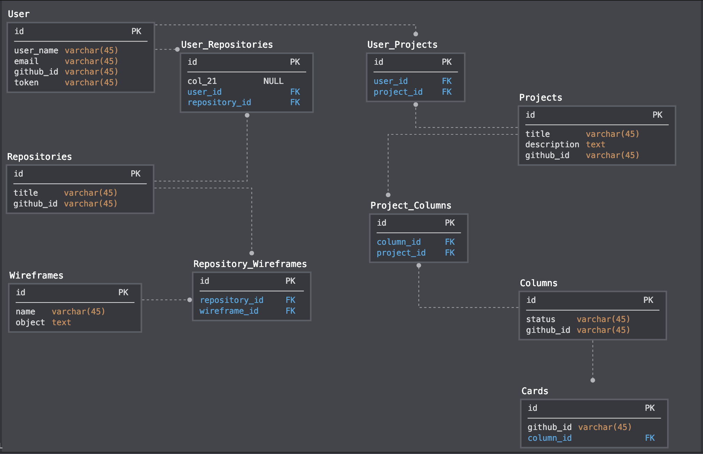

<!-- 
 -->
<!-- 
 -->
# About This Project
# Inital Setup
# How To Use 
# Running Tests
# Endpoints
# Dependencies
# Contributing
GitWired is an open source project. We invite your participation through issues and pull requests! 

When adding or changing a service please add tests.

Issues needing additional support:
- Issue 1
- Issue 2

# Related Projects
The GitWired frontend application is a JavaScript/React application that consummes the endpoints provided in this API.

More information about GitWiredFe can be found [here](https://github.com/JoelSmith123/git_wired_fe).

# Schema

# Contributors
This is a Capstone project for students wrapping up their studies at the Turing School of Software and Design.  The entire project consists of a backend Rails API application that provides endpoints for a JavaScript/React frontend application to consume.

Contributors to the backend application are [Harper Bellows](@hbellows) and [Jordan Whitten](@jordanwa1947).

Contributors to the frontend application are [Kate Rimkunas](@kate-v2) and [Joel Smith](@joelsmith123)
